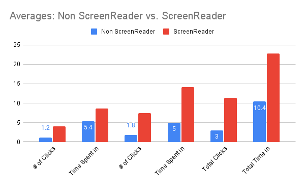
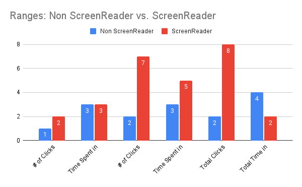
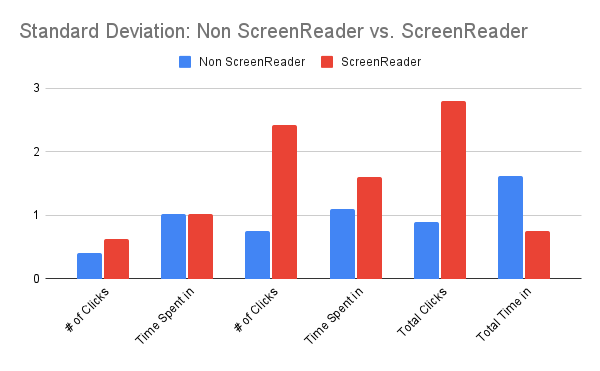

\newpage

---
title:  'Milestone 3: `StreamEZ` User Documentation'
date: \today
author:
- \small _Promise, Wycliff, William Burroughs_ and _Ansolo_
lang: en-GB
geometry:
- margin=1in
mainfont: Lato
fontsize: 11pt
toc: true
header-includes: |
    \hypersetup{pdftex,
            pdftitle={Milestone 3: StreamEZ User Documentation},
            pdfauthor={Promise, Wycliff, William Burroughs, Ansolo},
            pdfsubject={Milestone 3},
            pdfproducer={Latex with hyperref, or other system},
            pdfcreator={xelatex, or other tool}}
...

# Study Design

## Purpose

|    The purpose of this study is to find any improvements that can be made to increase the ease of use for our users. When designing this interface, a more minimal design approach was taken to ensure that everything could be done quickly and easily. However in creating a simplistic design, sometimes important descriptions or context clues are overlooked in favor of the design. We believe that with this study we can identify those additional changes to make.

|    By monitoring users while they attempt to achieve certain tasks we give them, we can learn what would improve the design of the site in terms of accessibility and ease of use. This may include changes like increasing the overall size of certain elements to make them stand out or adding additional text descriptions to make the user experience easier for those with accessibility requirements.

|    The purpose of this study is to find out what additional changes we could make to increase accessibility for all our users. By monitoring how they’re interacting with the user interface we can develop a list of changes to make to the overall design of the site.

## Concerns and Goals

_Concerns:_

* Accessibility
* Ease of Use Navigating Streaming Site
* Ease of Use Looking Up Specific Titles
* Screen Reader Compatibility

_Goals:_

* Accessibility for vision impaired users:
* Vision impaired users should be able to search for a title within x seconds/clicks.
* Impaired user will be able to find all titles list within x seconds/clicks of viewing home page.
* Ease of Use Navigating the Site
* The user will be able to deduce the quick method of navigating between pages in x seconds.
* The user will be able to locate the About Us page within x seconds.
* Ease of Use Looking Up Specific Titles
* The user will be able to locate the search bar within x seconds of loading the page.
* The user will be able to find the provider link to the requested title within x seconds of loading the result.
* Screen Reader Compatibility
* The screen reader will have a text-to-speech description for every object on the result page. 
* The screen reader should accurately describe an object upon hovering.

## Tasks

_Scenario 1:_

1. Search for 13 Reasons Why: Behind the Reasons and Navigate to 13 Reasons Why: Behind the Reasons Show Information Page
2. Find and Read short synopsis/play trailer and then navigate back to homepage
3. Find Selection of Suggested Titles and Select 1
4. Redirect to streaming site that show is hosted on

_Scenario 2:_

TODO: add scenario

## Scenarios

1. You want to search for a specific movie you saw people talking about on
Twitter last week. You know it has to be on streaming services since
everyone is talking about it but doesn’t know which one it is. When you
Google search the movie title for the answer, the only result you get
quickly is Prime Video, with a 4.99 rent price. You want a way to search
that will give you a definitive answer for what streaming service the title is
available on.

2. You just finished your last show and are currently looking for a new one to
start. You first check social media but only see a bunch of titles you have
never heard of. You are looking for a quick way to find out more about
these titles and redirect to the necessary streaming site when you want.

## Measurements

|    The following is the measurement type used for each task.

|    **Quantitative**

- Time for task completion (in seconds)
- Total clicks

## Test Methods

|    Our test method of choice is an assessment test to identify any bottlenecks with our current prototype and how we can improve the user experience. Each participant will be observed by a team member to ensure timing accuracy. The participant will be instructed to complete all the tasks listed, while the team member records the time taken and number of clicks. From this test, we can determine additional changes needed to maximize ease of use.

|    For conclusive results, we aim to evaluate at least 10 users. The target population is students or young-adults who frequently stream titles and have trouble locating providers. Half the participants will use the standard GUI interface, while the other half navigates the interface blindfolded using `ScreenReader`. 

# Study Script

|    The following is a sample script testers can use when evaluating a participant.

- **Greeting and Proposition**
    - Hello, how are you? Would you be interested in helping me out with a project for my User Interfaces course? I need to test my website’s design for usability. You just need to click around the website, accomplishing tasks for my checklist, while ask you for your opinion. It will take 5-10 minutes at most. Will you help me make my site better?
\   
- **Preliminary Interview**
    - First, thank you for participating in the study. Before we start, let me give you a little background on what you'll be looking at. 
        + For UI, we designed a website for an online store.
        + This test is to find out how intuitive, useful, and efficient the design is.
        + I really need your opinion on what you think of the site as you use it, so during the test, please don’t hesitate to let me know what you are thinking.
\   
    - Now, I just need to ask a couple of preliminary questions before we begin.
        + Do you consider yourself an expert on using the Internet?
        + Have you ever shopped online before?
            - (If yes) Can you name some sites you’ve shopped on?
        + How comfortable are you with shopping online? (Very or not very)
        + If you had to choose, would you rather shop online or shop in an actual store?
        + Have you ever shopped online for technology products, like laptops or cameras?
\   
    - For testing purposes, we’d like to record the age and majors of our participants. Do you mind giving me that information?
        + If yes: 
            - OK, no problem. Let's move forward.
        + If no:
            - How old are you?
            - What is your major?
    - Thank you. Now, we can begin the actual test.
\   
- **Providing Instructions**
    - Please type in the following URL: FIXME: add URL
    - Starting now, I am going to tell you to accomplish a specific task on this site.
    - I want you to try and accomplish this task any way you are comfortable with.
    - While you are accomplishing each task, I would like you to think out loud about where
    - you are looking and why you choose to click or do what you do.
    - If you are ever confused, just ask me and I will try to answer any of your questions.
    - If I can’t answer a question because it will affect the test, I will answer it after the test is complete.
    - I am very interested in hearing your opinions, so please do not hesitate to say what you think.
    - After you finish a task, I will give you the next one.
    - Do you have any questions?
\   
- **Conducting the Test**
    - Use the "Usability Test Form" attached to conduct the test.
    - Make sure to time how long it takes the participant to accomplish each task.
    - Make sure to note how the participant chooses to accomplish each task.
    - Try to keep the participant talking so they will explain their actions and thought process.
\   
- **Debriefing the Participant**
    - Alright, that finishes the testing portion.
    - Do you have any questions for me?
    - Before we’re done, I have a few more questions about the site you just looked at.
    - Do you have any recommendations for how we can improve the design?
        + Use the "Usability Test Form" attached for debriefing questions.
    - Do you have any last opinions on the site?
    - Thank you so much for helping me out and have a great day.

# Results

|    This section will cover the results of the 11 usability tests our team conducted. We input our test results into a Google Form and generated graphs from the results. These graphs can be found in this section along with our analysis of the errors, successes, and uncertainties found in our results.

## Graphs

| The following graphs display our results from the user study.

|           |
| --- | --- |
| {width=50%} | {width=50%} |
| {width=50%}  |

## Identify Problems

|    Based on our test results we found that 20% of participants were misled about what was clickable and what wasn't, for example on the show page there is a highlighted section for watch now that isn't an actual link. We need to make the section accurate and not have random underlined texts that people would want to click

|    Given our results, we doubt that they were fully constructive to get a good grasp of where our design lies because of the bias of the participants. In the future the test should be almost anonymous to where we can truly discern our greatest issues.

## Prioritize Problems
## Theorize Problems
## Identify Successes

- Home Page: In most cases the average user was able to successfully understand the homepage and find areas to interact with. For instance scrolling through the list of shows and redirecting to the homepage if they clicked anything else

- Navigation: Through our tests we found that it was rather simple for users to search a show and get to the page. While also being able to easily navigate back to the home page

- Recognizable: While accessing the homepage we found that users could view shows that they were familiar with, given the portraits we provided. Instead of just texts

- Amicable Links: We were pleased to find that users liked the links we provided for each title that allowed them to instantaneously visit the platform where that show was currently streaming.

- User Completed Tasks: We found that users were able to seamlessly navigate through all the functions of our website and not experience any bugs or broken links

## Identify Areas of Uncertainty

## Recommendations and Future Work

- Revamp how our selected show page displays information. We found that there were a couple dead youtube links that wouldn't render a video and its looks bad on our end

- Home page is a little dull and needs more designs. We found that our home page has basic designing and even stretches some contents out to have an illusion of being full

- Search Bar optimization. We found that the search bar lacked a common hidden feature after a search has been executed. 

- Better filtering. We found that our site has no way of filtering results based on what the user might be looking for. They are expected to know what they want to look for and even when they search for something we have, there's no clear way to filter what platforms they belong to.

