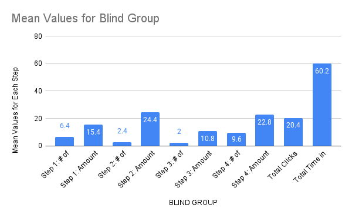
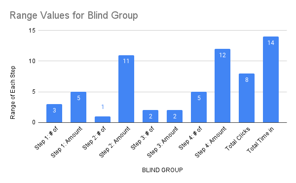
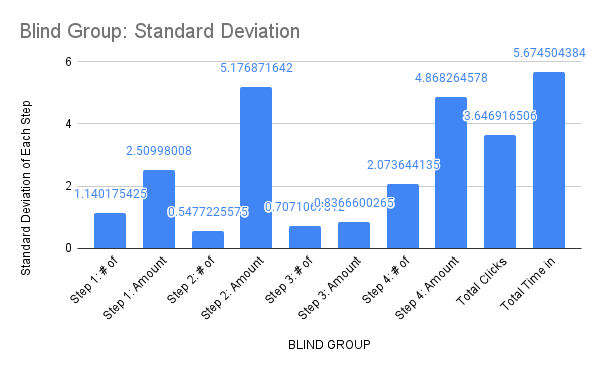
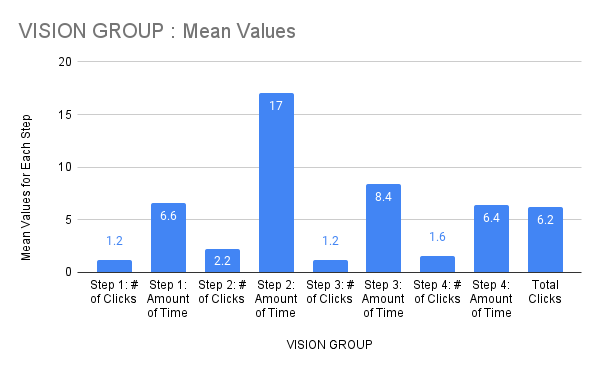
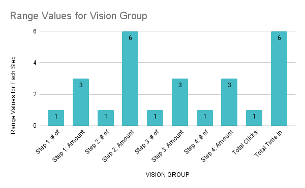
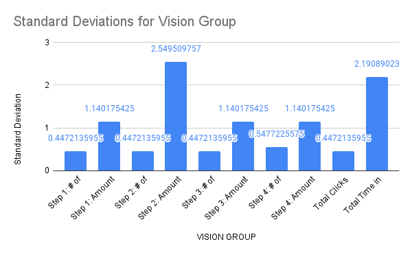

\newpage

---
title:  'Milestone 3: `StreamEZ` User Documentation'
date: \today
author:
- \small _Promise Onwuegbuchu, Wycliff Lumumba, William Burroughs_ and _Ansolo De La Rosa_
lang: en-GB
geometry:
- margin=1in
mainfont: Lato
fontsize: 11pt
toc: true
header-includes: |
    \hypersetup{pdftex,
            pdftitle={Milestone 3: StreamEZ User Documentation},
            pdfauthor={Promise Onwuegbuchu, Wycliff, William Burroughs, Ansolo},
            pdfsubject={Milestone 3},
            pdfproducer={Latex with hyperref, or other system},
            pdfcreator={xelatex, or other tool}}
...

\let\OldRule\rule
\renewcommand{\rule}[2]{\OldRule{\linewidth}{#2}}

# Study Design

## Purpose

|    The purpose of this study is to find any improvements that can be made to increase the ease of use for our users. When designing this interface, a more minimal design approach was taken to ensure that everything could be done quickly and easily. However in creating a simplistic design, sometimes important descriptions or context clues are overlooked in favor of the design. We believe that with this study we can identify those additional changes to make.

|    By monitoring users while they attempt to achieve certain tasks we give them, we can learn what would improve the design of the site in terms of accessibility and ease of use. This may include changes like increasing the overall size of certain elements to make them stand out or adding additional text descriptions to make the user experience easier for those with accessibility requirements.

|    The purpose of this study is to find out what additional changes we could make to increase accessibility for all our users. By monitoring how they’re interacting with the user interface we can develop a list of changes to make to the overall design of the site.

## Concerns and Goals

_Concerns:_

* Accessibility
* Ease of Use Navigating Streaming Site
* Ease of Use Looking Up Specific Titles
* Screen Reader Compatibility

_Goals:_

* Accessibility for vision impaired users:
* Vision impaired users should be able to search for a title within $x$ seconds/clicks.
* Impaired user will be able to find all titles list within $x$ seconds/clicks of viewing home page.
* Ease of Use Navigating the Site
* The user will be able to deduce the quick method of navigating between pages in $x$ seconds.
* The user will be able to locate the About Us page within $x$ seconds.
* Ease of Use Looking Up Specific Titles
* The user will be able to locate the search bar within $x$ seconds of loading the page.
* The user will be able to find the provider link to the requested title within x seconds of loading the result.
* Screen Reader Compatibility
* The screen reader will have a text-to-speech description for every object on the result page. 
* The screen reader should accurately describe an object upon hovering.

## Tasks

1. Search for 13 Reasons Why: Behind the Reasons and Navigate to 13 Reasons Why: Behind the Reasons Show Information Page
2. Find and Read short synopsis/play trailer and then navigate back to homepage
3. Find Selection of Suggested Titles and Select 1
4. Redirect to streaming site that show is hosted on

## Scenarios

1. You want to search for a specific movie you saw people talking about on
Twitter last week. You know it has to be on streaming services since
everyone is talking about it but doesn’t know which one it is. When you
Google search the movie title for the answer, the only result you get
quickly is Prime Video, with a 4.99 rent price. You want a way to search
that will give you a definitive answer for what streaming service the title is
available on.

2. You just finished your last show and are currently looking for a new one to
start. You first check social media but only see a bunch of titles you have
never heard of. You are looking for a quick way to find out more about
these titles and redirect to the necessary streaming site when you want.

## Measurements

|    The following is the measurement type used for each task.

|    **Quantitative**

- Time for task completion (in seconds)
- Total clicks

|    **Qualitative:**

-  Monitor user reactions while performing task(s)
-  Have user describe thought process out loud while completing tasks
-  User opinions on design aspect

## Test Methods

|    Our test method of choice is an assessment test to identify any bottlenecks with our current prototype and how we can improve the user experience. Each participant will be observed by a team member to ensure timing accuracy. The participant will be instructed to complete all the tasks listed, while the team member records the time taken and number of clicks. From this test, we can determine additional changes needed to maximize ease of use.

|    For conclusive results, we aim to evaluate at least 10 users. The target population is students or young-adults who frequently stream titles and have trouble locating providers. Half the participants will use the standard GUI interface, while the other half navigates the interface blindfolded using _ScreenReader_.

|    To begin, the tester will give the participant a summary of the assessment test. The tester will screen the participant, asking questions about their background to ensure a good fit for assessment. Next, each tester will ask the participant to read the task list and complete the tasks in-order. The team member will track time for each task and number of clicks taken. Team members will also note peculiar participant behaviors per task . After the test, participants will be thanked for their time.

|    In the case where a participant does not meet the requirements for screening, we
will not administer an assessment test as this may produce inconclusive data. We want all participants to receive equal assessment tests to ensure concise results. Participants should not perform tasks out of order as some tasks may have dependencies. The overall results may be inconclusive if participants deviate from the prescribed task flow.

## Study Script

|    The following is a sample script testers can use when evaluating a participant.

- **Greeting and Proposition**
    + Hello, how are you? Would you be interested in helping me improve on a project for my User Interfaces course? I need to test my website’s design for usability. All you will need to do is click around the website, completing tasks on a checklist. I’ll also ask you some questions about your experience and thought process. It’ll only take about 5 minutes, can you help?
\   
- **Preliminary Interview**
    - Thank you so much for deciding to participate in our study. Before we start, let me give you some quick background information so you can understand what we are attempting to accomplish today.
        + For UI, we designed a website directory for streaming service titles
        + This test is to find out how intuitive, useful, and efficient the design is
        + We are also looking to see how we can make our site more accessible for people with disabilities
        + Your opinion is invaluable so please don’t be afraid to share your thoughts and opinions
\   
    - Now I just need to ask a few background questions before we begin.
        + What is your age?
        + How many streaming applications are you currently subscribed to?
        + How do you find new titles to watch?
        + How would you rate difficulty of finding specific titles streaming location 
            - No difficulty
            - Some difficulty
            - Moderate difficulty
            - High difficulty
\   
    - Thank you. Now, we can begin the actual test.
\   
- **Providing Instructions**
    - Please type in the following URL: https://streamez-sydux.mongodbstitch.com/
    - Starting now, I am going to tell you to accomplish a specific task on this site.
    - I want you to try and accomplish this task any way you are comfortable with.
    - If you are ever confused, just ask me and I will try to answer any of your questions.
    - If I can’t answer a question because it will affect the test, I will answer it after the test is complete.
    - I am very interested in hearing your opinions, so please do not hesitate to say what you think.
    - After you finish a task, I will give you the next one.
    - Do you have any questions?
\   
- **Conducting the Test**
    - Time how long it takes the participant to accomplish each task.
    - Count and note the number of clicks per task
    - Take additional notes on how on occurrences during the test.
        - Try to keep the participant talking so they will explain their actions and thought process.
\   
- **Debriefing the Participant**
    - Alright, that finishes the testing portion.
    - Do you have any questions for me?
    - Before we’re done, I have a few more questions about the site you just looked at.
    - Do you have any recommendations or final thoughts for how we can improve the site?
    - Thank you so much for helping me out and have a great day.
\   

### Testing Tasks

**Task 1:** Search for 13 Reasons Why and Navigate to 13 Reasons Why Show Information Page

| Description              |  Measurement    |
| ---                      | ---             |
| \# of Clicks (Control)   | 1 - 2 clicks    |
| Amount of Time (Control) | 5 - 8 seconds   |
| \# of Clicks (Blinded)   | 5 - 8 clicks    |
| Amount of Time (Blinded) | 13 - 18 seconds |

|    **Comments:**
- Very streamlined for vision group, blind group had issues tabbing to search bar and needed assistance to select the search bar.

|    **Recommendations:**
- Increase functionality for keyboard navigation.

---

**Task 2:** Find and Read Short Synopsis/Play Trailer and then Navigate Back to Homepage

| Description              |  Measurement    |
| ---                      | ---             |
| \# of Clicks (Control)   | 2 - 3 clicks    |
| Amount of Time (Control) | 15 - 21 seconds |
| \# of Clicks (Blinded)   | 2 - 3 clicks    |
| Amount of Time (Blinded) | 20 - 31 seconds |

|    **Comments:** 
- Large Embedded video drew users attention immediately, and screen reader automatically reads synopsis very quickly since there is minimal text on this page. Clicking back home was an issue for blinded users, who knew the right location but just missed slightly.

|    **Recommendations:**
- Increase size of top navigation bar

---

**Task 3:** Find Selection of Suggested Titles and Select One

| Description              |  Measurement    |
| ---                      | ---             |
| \# of Clicks (Control)   | 1 - 2 clicks    |
| Amount of Time (Control) | 7 - 10 seconds  |
| \# of Clicks (Blinded)   | 1- 3 clicks     |
| Amount of Time (Blinded) | 10 - 12 seconds |

|   **Comments:**
- AutoReader automatically navigates screen to bottom where suggested titles are, however doesn’t read out the titles.

|   **Suggestions:**
- Add description text for the title so accessibility tools can read it.

---

**Task 4:** Redirect to Streaming Site that Show is Hosted On

| Description                |  Measurement    |
| ---                        | ---             |
| \# of Clicks (Control)     | 1 - 2 clicks    |
| Amount of Time (Control)   | 5 - 8 seconds   |
| \# of Clicks (Blinded)     | 7 - 12 clicks   |
| Amount of Clicks (Blinded) | 16 - 28 seconds |

|    **Comments:**
- Clicked the Watch Now text thinking it would redirect them, the blinded group had trouble clicking the logo to be redirected.

|    **Suggestions:**
- Make and stack large long rows with each streaming service that can be selected with keyboard navigation.

### Notes

- All ten participants were students in the range 18-25. Other crowds were not considered for assessment.
- The majority of all ten participants are subscribed to 2-4 providers. Few had less than 1 or greater than 7 subscriptions.
- All ten participants discover new titles primarily through social media or from close friends.
- All ten users reported moderate to high difficulty in finding appropriate stream providers based on a simple Google search.

# Results

|    This section will cover the results of the 11 usability tests our team conducted. We input our test results into a Google Form and generated graphs from the results. These graphs can be found in this section along with our analysis of the errors, successes, and uncertainties found in our results.

## Graphs

| The following graphs display our results from the user study.

### Blind Group

|           |
| --- | --- |
| {width=50%} | {width=50%} |
| {width=50%}  |

### Vision Group

|           |
| --- | --- |
| {width=50%} | {width=50%} |
| {width=50%}  |

## Identify Problems

- Misleading Text that Users thought was clickable
- Blinded Navigation very difficult (more descriptor text needed)
- Keyboard Navigation Functionality is minimal
- Dead YouTube links
- Search Function could be improved (overload of results currently)
- Button to redirect to streaming site is too small

## Prioritize Problems

1. Blinded Navigation Difficult (Descriptor Text)
2. Button to redirect to streaming site is too small
3. Dead YouTube links
4. Misleading Text formatting that Users thought was clickable
5. Keyboard Navigation
6. Search Function functionality

## Theorize Reasons

-  Blinded Navigation Difficult
    + Simply an oversight on testing functionality of the website
\   
- Button to redirect to streaming site is too small
    + The button is a small square, which is good if we are lining up the icons next to each other but when there is only one streaming service it can be confusing.
\   
- Dead YouTube links
    + Some older links must’ve been selected when building site
\   
- Misleading Text Formatting
    + Underlined text usually means a hyperlink so users familiar with computers would think that text is also a link to the streaming site
\   
- Keyboard Navigation
    + Another small oversight when originally building site
\   
- Search Function functionality
    + Right now returns all results that match the letters the user has inputted which makes it look overwhelming.

## Theorize Solutions

- Blinded Navigation Issue
    + Just adding more descriptor text for the title cards and other aspects of the page that would be readable by the screen reader would greatly improve navigation ability
\   
- Button is Too Small Issue
    + Stack long rows of streaming service links rather than arranging them horizontally
\   
-  Dead YouTube links
    + This is an easy fix, just update to newer Youtube links
\   
-  Misleading Text Formatting
    + Avoid Using Underline for any text formatting unless it is also a hyperlink
\   
- Keyboard Navigation
    + Add HTML for keyboard navigation along with other visual cues of where the cursor is when tabbing

## Identify Successes

|    The idea of the site was to be a quickly accessible tool to help users learn about and stream new shows. The home page definitely achieves this very well. By keeping the on screen elements very minimal it doesn’t confuse the user on what to do to search for titles or to get recommendations. To the same effect of quickly navigating our users to what they’re looking for, the show information page is set up so that users are immediately drawn to the trailer of the show. The information is all immediately available allowing them to make a decision quickly about whether they want to watch the show or continue searching. The top menu bar is also very easy to understand allowing for quick navigation back to the home page to continue the search.

## Identify Areas of Uncertainty

|    For future studies adding an anonymous factor to the group would have improved our results and findings. Also when testing blind testing conditions we had to guide users to use the Screen Reader and their ability to use it often affected their ability to navigate through the page. Having a separate set of people to take the test blind would’ve also helped yield stronger results.

## Recommendations and Future Work

- Revamp how our selected show page displays information. We found that there were a couple dead youtube links that wouldn't render a video and its looks bad on our end

- Home page is a little dull and needs more designs. We found that our home page has basic designing and even stretches some contents out to have an illusion of being full

- Search Bar optimization. We found that the search bar lacked a common hidden feature after a search has been executed. 

- Better filtering. We found that our site has no way of filtering results based on what the user might be looking for. They are expected to know what they want to look for and even when they search for something we have, there's no clear way to filter what platforms they belong to.

